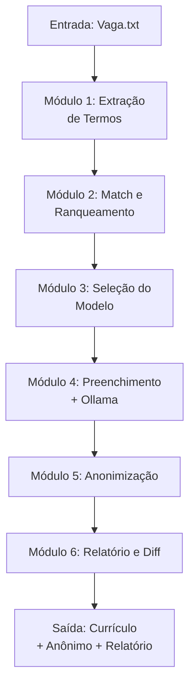

# 🚀 Sistema de Automação de Currículos (CV Generator)

---

## 📌 Sumário

- [🚀 Sistema de Automação de Currículos (CV Generator)](#-sistema-de-automação-de-currículos-cv-generator)
  - [📌 Sumário](#-sumário)
  - [🎯 Visão Geral](#-visão-geral)
  - [🧠 Arquitetura do Sistema](#-arquitetura-do-sistema)
  - [📂 Estrutura de Pastas](#-estrutura-de-pastas)
  - [🛠️ Pré‑requisitos](#️-prérequisitos)
  - [📦 Instalação e Configuração](#-instalação-e-configuração)
  - [⚙️ Como Usar](#️-como-usar)
  - [📄 Descrição dos Módulos (Python)](#-descrição-dos-módulos-python)
  - [🔒 Segurança e Privacidade](#-segurança-e-privacidade)
  - [📈 Próximos Passos e Evolução](#-próximos-passos-e-evolução)

---

## 🎯 Visão Geral

Este sistema automatiza a geração de currículos personalizados com base em uma descrição de vaga e no seu inventário de competências. Ele é o resultado prático de todo o conhecimento construído nos 16 capítulos teóricos do projeto `01 - curriculo`.

**O que o sistema faz:**

1. Lê uma descrição de vaga fornecida pelo usuário.
2. Extrai palavras‑chave técnicas e não técnicas.
3. Compara com seu inventário de competências (hard e soft).
4. Calcula um **score de match** (0 a 100%) para cada perfil de vaga (Redes, TI, Automação, etc.).
5. Escolhe o modelo de currículo mais adequado.
6. Preenche o modelo com seus dados pessoais e experiências.
7. (Opcional) Utiliza **Ollama (local)** para gerar um resumo profissional e frases STAR adaptadas à vaga.
8. Gera o currículo completo em Markdown.
9. Gera uma versão **anonimizada** (substitui nome, e-mail, telefone por placeholders) para conformidade com LGPD/PII.
10. Gera um relatório (diff e score).

---

## 🧠 Arquitetura do Sistema

O sistema é orquestrado por um `main.py` que chama os módulos na seguinte ordem:



---

## 📂 Estrutura de Pastas

```markdown
03 - sistema automacao/
├── .gitignore                 # Ignora dados pessoais e cache
├── requirements.txt           # Dependências Python
├── config/
│   ├── competencias.json      # Seu inventário de competências (hard + soft)
│   └── perfis.json            # Mapeamento: competências → perfis (NOC, SOC, etc.)
├── dados/
│   └── meu_curriculo_mestre.json  # Seus dados pessoais (NÃO COMMITAR!)
├── docs/                      # Documentação extra (como instalar Ollama)
├── modelos/                   # Modelos de currículo (Markdown)
│   ├── mod_analista_redes.md
│   ├── mod_analista_ti.md
│   ├── mod_generico.md
│   └── mod_netdevops.md
├── src/                       # Código Python
│   ├── 01_extracao.py         # Extrai termos da vaga
│   ├── 02_match_score.py      # Calcula score e ranqueia
│   ├── 03_selecao_modelo.py   # Escolhe modelo
│   ├── 04_preenchimento.py    # Preenche com Jinja2 + Ollama
│   ├── 05_anonimizacao.py     # Anonimiza dados pessoais
│   ├── 06_relatorio_diff.py   # Gera diff e relatório
│   ├── main.py                # Orquestrador
│   └── utils.py               # Funções auxiliares (ler JSON, salvar arquivos)
└── saidas/                    # Currículos gerados
    ├── raw/                   # Versões completas (com dados)
    └── anonimos/              # Versões anônimas (prontas para enviar)
```

## 🛠️ Pré‑requisitos

- Python 3.8+ instalado.
- Ollama instalado e rodando (para geração de narrativa com IA).
- Um modelo local baixado (ex: ollama pull llama3.2).

## 📦 Instalação e Configuração

- Clone o repositório (ou copie a pasta 03 - sistema automacao).
- Crie um ambiente virtual (recomendado):

```bash
python -m venv venv
source venv/bin/activate  # Linux/Mac
venv\Scripts\activate     # Windows
```

- Instale as dependências:

```bash
pip install -r requirements.txt
```

- **Configure seus dados:** Edite o arquivo dados/meu_curriculo_mestre.json com suas informações reais (nome, experiência, certificações, etc.).
- **Configure o inventário:** Edite config/competencias.json e config/perfis.json com suas competências e o mapeamento para cada perfil de vaga.

> ⚠️ Atenção: Nunca commite a pasta dados/ ou config/competencias.json se ele contiver dados pessoais. O .gitignore já está configurado para ignorar essas pastas.

## ⚙️ Como Usar

Execute o orquestrador a partir da pasta raiz do sistema:

```bash
python src/main.py --vaga "caminho/para/descricao_da_vaga.txt"
```

Opções:

- --vaga: Caminho para o arquivo de texto com a descrição da vaga (obrigatório).
- --modelo: Força um modelo específico (ex: mod_analista_redes).
- --no-ollama: Ignora a geração de narrativa com IA (usa resumo estático).

---

## 📄 Descrição dos Módulos (Python)

| **Módulo**           | **Descrição**                                                                                                                   |
| :---                 | :---                                                                                                                            |
| 01_extracao.py       | Lê o texto da vaga e extrai um conjunto de termos técnicos e não técnicos usando regex e uma lista de stopwords.                |
| 02_match_score.py    | Compara os termos extraídos com o inventário (competencias.json), calcula o score para cada perfil e retorna o perfil vencedor. | 
| 03_selecao_modelo.py | Seleciona o modelo Markdown correspondente ao perfil vencedor.                                                                  |
| 04_preenchimento.py  | Utiliza Jinja2 para preencher o modelo com dados do JSON mestre. Opcionalmente, chama o Ollama para gerar resumo e frases STAR. |
| 05_anonimizacao.py   | Substitui nome, e-mail, telefone, LinkedIn e GitHub por placeholders ([NOME], [EMAIL], etc.).                                   |
| 06_relatorio_diff.py | Salva os arquivos nas pastas raw/ e anonimos/, gera um diff.txt e exibe o score final.                                          |
| main.py              | Orquestrador que chama os módulos na ordem correta.                                                                             |

## 🔒 Segurança e Privacidade

- **Dados locais:** Nenhum dado pessoal é enviado para a nuvem. A IA (Ollama) roda localmente.
- **Anonimização:** O sistema gera automaticamente uma versão anônima para compartilhamento seguro.
- **.gitignore:** As pastas dados/ e saidas/ estão protegidas contra envio acidental para o GitHub.

## 📈 Próximos Passos e Evolução

- **Dashboard:** Futuramente, um módulo 07_dashboard.py com Plotly e Streamlit para visualizar o histórico de vagas, scores e gaps de competências.
- **Novos Modelos:** Você pode adicionar novos modelos Markdown na pasta modelos/ e atualizar perfis.json para incluí-los.